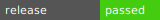

 [](https://ko-fi.com/T6T41IT163)

# StageFreight

> A declarative CI/CD automation CLI that detects, builds, scans, and releases container images across forges and registries — from a single manifest.

---

## Overview

**StageFreight** is a Go CLI and container image that replaces fragile shell-script CI pipelines with a single binary. Point it at a repository and it will:

1. **Detect** the project layout (Dockerfiles, languages, git metadata)
2. **Plan** the build (resolve tags, platforms, registries, build args)
3. **Lint** the changeset (secrets, conflicts, large files, encoding — cache-aware, delta-only)
4. **Build** container images via `docker buildx` (multi-platform, multi-registry)
5. **Scan** for vulnerabilities (Trivy integration, SBOM generation)
6. **Release** across forges (GitLab, GitHub, Gitea) with notes, badges, and cross-platform sync

All driven by a single [`.stagefreight.yml`](.stagefreight.yml) manifest. No platform-specific CI scripting required.

---

## Quick Start

```yaml
# .stagefreight.yml
version: 1

docker:
  platforms: [linux/amd64]
  registries:
    - url: docker.io
      path: yourorg/yourapp
      tags: ["{version}", "latest"]
      branches: ["^main$"]
      credentials: DOCKERHUB
```

```yaml
# .gitlab-ci.yml
build-image:
  image: docker.io/prplanit/stagefreight:latest
  services:
    - docker:24.0.5-dind
  script:
    - stagefreight docker build
  rules:
    - if: '$CI_COMMIT_TAG'
```

```bash
# or run locally
docker run --rm -v "$(pwd)":/src -w /src \
  -v /var/run/docker.sock:/var/run/docker.sock \
  docker.io/prplanit/stagefreight:latest \
  stagefreight docker build --local
```

---

## Key Features

- **Declarative manifest** — one `.stagefreight.yml` drives everything, no shell scripts
- **Auto-detection** — finds Dockerfiles, injects VERSION/COMMIT/BUILD_DATE build args from git
- **Multi-registry push** — Docker Hub, GHCR, GitLab, Quay, Harbor, JFrog — with branch/tag filtering via regex patterns (`!` negation supported)
- **Security scanning** — Trivy vulnerability scan with configurable detail levels (none/counts/detailed/full) per branch or tag pattern
- **Cross-forge releases** — create releases on GitLab, sync to GitHub/Gitea mirrors with assets and badges
- **Cache-aware linting** — 7 lint modules run in parallel, only on changed files
- **Self-building** — StageFreight builds itself (this image is produced by `stagefreight docker build`)

---

## CLI Commands

```
stagefreight docker build    # detect → plan → lint → build → push
stagefreight lint             # run lint modules on the working tree
stagefreight security scan    # trivy scan + SBOM generation
stagefreight release create   # create forge release with notes + sync
stagefreight release notes    # generate release notes from git log
stagefreight release badge    # generate/commit release status badge
stagefreight version          # print version info
```

---

## Image Contents

Based on **Alpine 3.22** with a statically compiled Go binary:

| Category | Tools |
|----------|-------|
| **CLI** | `stagefreight` (Go binary) |
| **Container** | `docker-cli`, `docker-buildx` |
| **Scripting** | `bash`, `python3`, `jq`, `yq` |
| **Utilities** | `curl`, `git`, `rsync`, `tree`, `coreutils` |

### Looking for a minimal image?

If you need a pure DevOps toolchain image without the StageFreight CLI (just Ansible, scripts, etc.), use older tags or our dedicated Ansible image:

| Image | Purpose |
|-------|---------|
| [`prplanit/stagefreight:0.1.1`](https://hub.docker.com/r/prplanit/stagefreight) | Last pre-CLI release — vanilla DevOps toolchain (bash, docker-cli, buildx, python3, yq, jq, etc.) |
| [`prplanit/ansible-oci`](https://hub.docker.com/r/prplanit/ansible-oci) | Ansible-native image — Python 3.13 + Alpine 3.22, ansible-core, ansible-lint, sops, rage, pywinrm, kubernetes.core, community.docker, community.sops |

Starting from **0.2.0**, `prplanit/stagefreight` includes the Go CLI binary and is purpose-built for `stagefreight docker build` workflows.

---

## See Also

- [StageFreight Ansible](https://github.com/sofmeright/stagefreight-ansible) — Legacy Ansible-based GitLab CI component (archived)
- [Roadmap](docs/RoadMap.md) — full feature roadmap and manifest examples
- [Manifest Examples](docs/config/) — 24 example `.stagefreight.yml` configurations
- [GitLab CI Component](templates/) — reusable CI templates for GitLab

---

## Contributing

- Fork the repository
- Submit Pull Requests / Merge Requests
- Open issues with ideas, bugs, or feature requests

## License

Distributed under the [AGPL-3.0-only](LICENSE) License.
